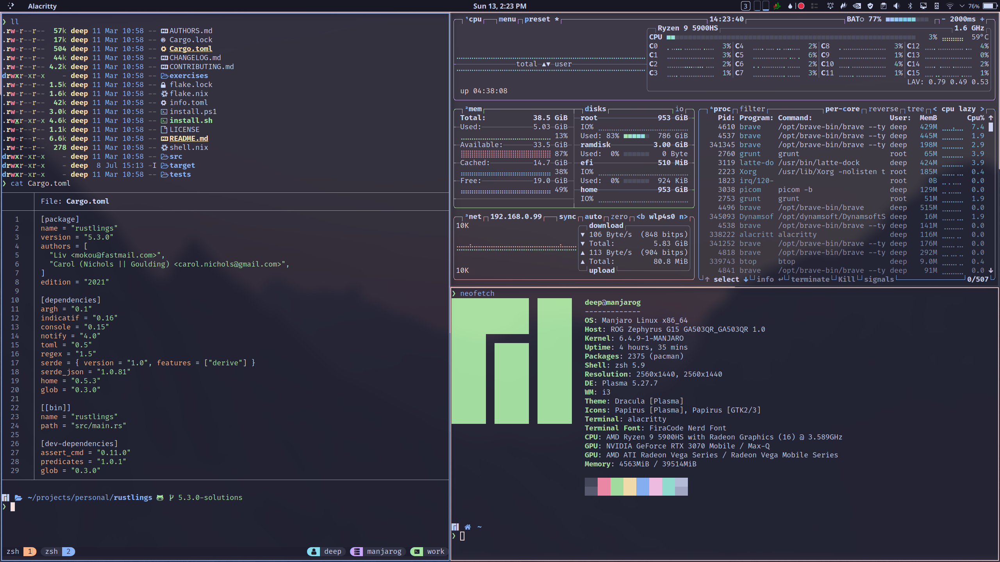
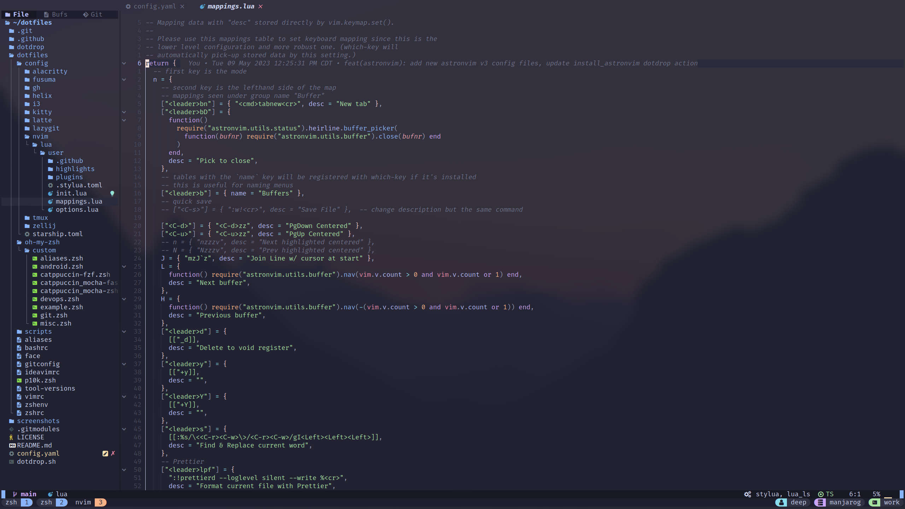

# Dotfiles

My current system config files.

```
██████████████████  ████████   deep@manjarog
██████████████████  ████████   -------------
██████████████████  ████████   OS: Manjaro Linux x86_64
██████████████████  ████████   Host: ROG Zephyrus G15 GA503QR_GA503QR 1.0
████████            ████████   Kernel: 6.2.16-2-MANJARO
████████  ████████  ████████   Uptime: 4 hours, 46 mins
████████  ████████  ████████   Packages: 2348 (pacman)
████████  ████████  ████████   Shell: zsh 5.9
████████  ████████  ████████   Resolution: 2560x1440, 2560x1440
████████  ████████  ████████   DE: Plasma 5.27.5
████████  ████████  ████████   WM: i3
████████  ████████  ████████   Theme: Dracula [Plasma]
████████  ████████  ████████   Icons: Papirus [Plasma], Papirus [GTK2/3]
████████  ████████  ████████   Terminal: tmux
                               CPU: AMD Ryzen 9 5900HS with Radeon Graphics (16) @ 3.595GHz
                               GPU: NVIDIA GeForce RTX 3070 Mobile / Max-Q
                               GPU: AMD ATI Radeon Vega Series / Radeon Vega Mobile Series
                               Memory: 15569MiB / 39514MiB
```

## Screenshots




